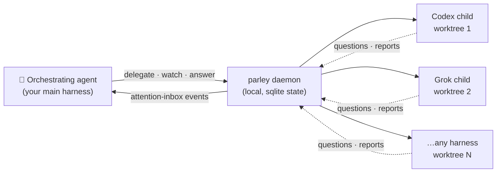
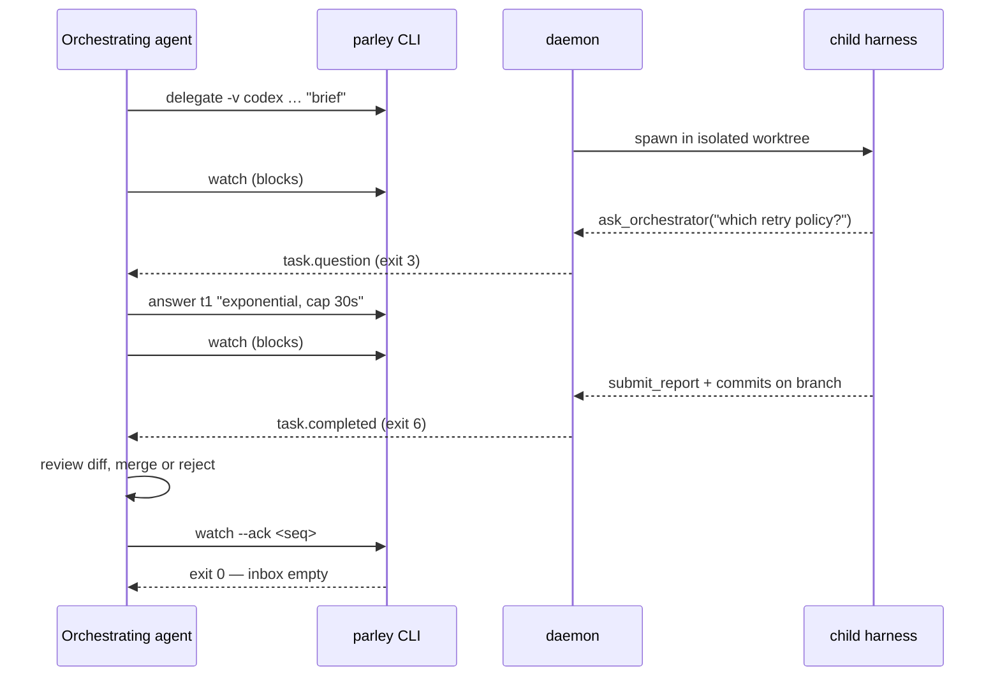

# parley

**Give your agent a crew: one orchestrating agent, many coding agents, every
branch reviewed before it lands.**

Parley is built for agent-to-agent delegation. The agent you already work in —
Claude Code or any other harness — uses the `parley` CLI to spawn child coding
agents (Codex, Grok, and more) in isolated git worktrees, coordinated by one
local daemon. The orchestrator writes the brief, answers the child's questions,
reviews the branch, and decides what merges. Parley never merges; judgment
stays with the orchestrator.



- **Fan-out**: ten briefs, ten worktrees, ten agents in parallel — no stepping
  on each other, every branch reviewable on its own.
- **One wait primitive**: `parley watch` delivers exactly the events that need
  the orchestrator (question, stall, failure, completion), with at-least-once
  redelivery until acked. No polling loops.
- **Vendor-agnostic**: one interface over the supported harnesses, plus a
  public adapter contract for your own.
- **Accountable**: every task records tokens, duration, profile, and
  classification — sliceable by vendor, model, or profile with `parley metrics`.

## Install

```bash
npm install -g @useparley/cli   # the CLI (daemon auto-spawns on first use)
npm install -g @useparley/ui    # optional: the web cockpit (parley ui)
```

Requires Node ≥ 24 and git. Each vendor CLI you delegate to must be installed
and authenticated on the machine that runs it.

## Set up: `parley init`

One command, run in your repo:

```bash
parley init
```

It installs the orchestrator skills, detects which harness CLIs are on your
PATH, refreshes the model catalog, and walks you through an opt-in picker:
which vendors to configure, which models to allow, which efforts, and the
defaults. Everything is skippable — submit an empty selection to move on.

| Skill | Purpose |
| ----- | ------- |
| `parley-delegate` | the orchestrator loop: brief → delegate → watch → answer → review |
| `parley-wizard` | conversational setup: profiles, task types, project config |

Both skills ship with model invocation **disabled by default** — they load only
when invoked explicitly (`/parley-delegate`, `/parley-wizard`), since that is
how they are used most of the time. Re-enable auto-triggering by removing
`disable-model-invocation: true` from a skill's frontmatter.

## Usage: the delegation loop (What the orchestrator runs)

```bash
parley info                       # prints instructions based on your configuration
parley session                    # register the orchestrating session once

# 1. Delegate (returns immediately with a pending task)
parley delegate -v codex -m gpt-5.6-sol --effort low -n fix-flaky \
  "Fix the flaky retry test in packages/api. Done when 'pnpm test' is green."

# 2. Wait — the only wait primitive. Exit codes tell you what happened:
parley watch --json
#   3 = child asked a question  → parley answer <task> "…"
#   4 = stalled                 → parley answer resumes it
#   5 = failed                  → triage, then watch --ack <seq>
#   6 = completed               → review the branch, merge if it holds up,
#                                 then watch --ack <seq>
#   0 = all done, inbox empty

# 3. Review & integrate — the branch is yours to judge
git diff main..parley/t1-fix-flaky
parley clean t1                   # removes the worktree, keeps the branch
```

Every event that needs attention flows back through the same loop — questions
mid-task, stalls, failures, and the final report:



`parley fix <task> "<brief>"` opens a linked reattempt when a review finds
gaps; `parley status`, `parley logs`, and `parley metrics` cover inspection
and aggregates. `parley info` prints the effective project configuration as
orchestrator-readable prose.

## Vendors

| Vendor | CLI | Status |
| ------ | --- | ------ |
| `codex` | OpenAI Codex CLI | ✅ tested |
| `grok` | Grok Build | ✅ tested |
| `claude` | Claude Code | 🧪 under testing |
| `gemini` | Gemini CLI | 🧪 under testing |
| `opencode` | OpenCode | 🧪 under testing |
| `goose` | Goose | 🧪 under testing |
| `pi` | Pi coding agent | 🧪 under testing |
| `cline` | Cline CLI | 🧪 under testing |
| `kilo` | Kilo CLI | 🧪 under testing |
| `openhands` | OpenHands | 🧪 under testing |
| `hermes` | Hermes Agent | 🧪 under testing |
| `openclaw` | OpenClaw | 🧪 under testing |
| `kimi` | Kimi Code CLI | 🧪 under testing |

Every adapter accepts the same posture **flags** — `--sandbox
read-only|workspace|full` and `--no-network` — and passes model and reasoning
effort through opaquely (`-m`, `--effort`). **Enforcement is not portable**:
several vendors only approximate isolation (or accept the flag and do nothing).
See the matrix below (sourced from each adapter's `enforcement` declaration;
`parley info` prints the same table). Cells marked `approximate` or `none` mean
the flag is accepted but **not** OS-enforced — prepare writes a one-line
`PARLEY-DIAG` warning to the task's `diag.log`. The `full` column is always
`enforced` (unrestricted access is what full asks for) and never produces a
sandbox-dimension diagnostic.

<!-- enforcement-matrix:start -->
| Vendor | read-only | workspace | full | network:false |
| ------ | --------- | --------- | ---- | ------------- |
| `claude` | approximate (permission-mode dontAsk + tool allowlist) | approximate (permission-mode acceptEdits + tool allowlist) | enforced (bypassPermissions) | approximate (Bash sandbox settings when not full; MCP path may bypass) |
| `cline` | approximate (CLINE_COMMAND_PERMISSIONS deny-all shell (edit tools may still write)) | none (unconstrained tools + auto-approve) | enforced (unconstrained tools + auto-approve (unrestricted as requested)) | none (no first-class network toggle) |
| `codex` | enforced (sandbox_mode=read-only) | enforced (sandbox_mode=workspace-write) | enforced (sandbox_mode=danger-full-access) | enforced (sandbox_workspace_write.network_access off under workspace; ignored for read-only/full) |
| `gemini` | approximate (approval-mode=plan) | none (yolo; no process sandbox when network on) | enforced (yolo, sandbox off) | refused (prepare refuses except macOS workspace seatbelt (#107)) |
| `goose` | approximate (GOOSE_MODE=chat (no tools / file mods)) | none (GOOSE_MODE=auto; no OS sandbox) | enforced (GOOSE_MODE=auto (unrestricted as requested)) | none (no native network toggle) |
| `grok` | enforced (bubblewrap OS sandbox; fail-closed without bwrap (#247)) | enforced (bubblewrap OS sandbox + worktree gitdir grants; fail-closed without bwrap (#247/#278)) | enforced (GROK_SANDBOX=off) | enforced (restrict_network in custom sandbox profile (sandboxed postures; ignored for full)) |
| `hermes` | approximate (HERMES_WRITE_SAFE_ROOT limited to private home (terminal may still write)) | approximate (HERMES_WRITE_SAFE_ROOT=worktree+gitdirs) | enforced (unset HERMES_WRITE_SAFE_ROOT) | none (local backend has no egress filter) |
| `kilo` | approximate (restrictive permissions + optional OS sandbox object) | none (sandbox disabled so git commits + hub MCP work) | enforced (sandbox disabled (unrestricted)) | approximate (sandbox.network=deny (also blocks hub MCP)) |
| `kimi` | approximate (--plan (soft exploration mode)) | none (print-mode afk auto-approve only) | enforced (print-mode afk auto-approve (unrestricted as requested)) | none (cannot be enforced) |
| `openclaw` | enforced (docker mode=all workspaceAccess=ro (fail-closed if image missing)) | approximate (mode=off when network on (host tools); mode=all docker when network off) | enforced (mode=off) | enforced (docker network=none under sandboxed postures) |
| `opencode` | approximate (permission deny write/edit/bash (no OS sandbox)) | approximate (permission policy only (no OS sandbox)) | enforced (permission allow-all (unrestricted as requested)) | approximate (webfetch/websearch deny only; bash can still egress) |
| `openhands` | none (no CLI sandbox matrix) | approximate (OPENHANDS_WORK_DIR soft worktree affinity) | enforced (host-local workspace; unrestricted as requested) | none (no network-off lever) |
| `pi` | approximate (--tools read-only allowlist) | none (default tools; no write sandbox) | enforced (default tools; unrestricted as requested) | refused (prepare refuses (#107)) |
<!-- enforcement-matrix:end -->

**Write your own**: adapters are a public contract in `@useparley/core`. Point
`vendors.<id>.plugin` at your module and the daemon loads it at startup — see
[docs/agents/adapter-authoring.md](docs/agents/adapter-authoring.md). Declare
`enforcement` for every posture dimension so `parley info` and the matrix stay
honest.

> **Note:** adapter support exists for all vendors listed, but only `codex`
> and `grok` have been exercised in sustained real-world orchestration so far.
> The rest are implemented and pass their suites, and are still being tested.

## Settings & profiles

`~/.parley/parley.json` (all optional, validated loudly):

```json
{
  "vendors": {
    "grok":  { "env": { "XAI_API_KEY": "…" } },
    "mycli": { "plugin": "parley-adapter-mycli" }
  },
  "profiles": {
    "heavy": { "vendor": "grok",  "model": "grok-4.5", "effort": "high" },
    "cheap": { "vendor": "codex", "effort": "low" }
  }
}
```

`parley delegate --profile heavy …` replaces the vendor/model/effort flags;
the profile is recorded on the task, so metrics can compare profiles
head-to-head. Vendor `bin`/`args`/`env` apply to every spawn of that vendor;
explicit flags always win.

## How children talk back

Three transports, one contract (`submit_report`, `ask_orchestrator`):

- **MCP** — injected per-vendor; the default.
- **HTTP** — `curl`-able: `POST /child/report`, `POST /child/ask` (long-poll),
  `GET /child/task`, correlated by the `x-parley-task` header. Every child
  gets `PARLEY_HUB_URL` / `PARLEY_TASK_ID` in env and `.parley/child.json`
  in its workspace.
- **CLI** — `parley child report|ask|task` wraps the HTTP surface for shell
  scripts and MCP-less harnesses.

## The cockpit

`parley ui` opens **Parley Cove** — a live view of every task: state,
transcript tail, Q&A history, usage, and metrics. Optional install; the
daemon serves it when present.

## Experimental

These features work but have not been thoroughly tested yet — expect rough
edges.

### Remote runners & remote daemon

Run children on other machines while keeping one daemon and one inbox:

```bash
# on the remote host
npm install -g @useparley/runner    # give it the daemon URL + a token

# in ~/.parley/parley.json
# "daemon":  { "url": "http://build-box:7777" },
# "runners": { "gpu-box": { "token": "…" } }

parley delegate --runner gpu-box …
```

The runner leases tasks, executes them with the same adapters and worktree
semantics, streams logs and heartbeats back, and pushes the finished branch to
your git remote for review. Outbound-only from the runner — no reach-in
credentials. Details: [docs/agents/remote-runners.md](docs/agents/remote-runners.md).

### Evaluation flow

Structured, rubric-based scoring of every delegated task:

```bash
parley eval t42 --answers '{"tests-pass": true, "brief-followed": true}' \
  --feedback "clean fix, good regression test"
parley delegate --size M --difficulty hard …   # classify at delegate time
```

Set it up with `/parley-wizard`, which interviews you into project eval
settings, task types, versioned rubrics, and classification guidance under
`.parley/` — the daemon computes scores and baselines from your boolean
answers, and `parley metrics` (and the cockpit) render the aggregates.