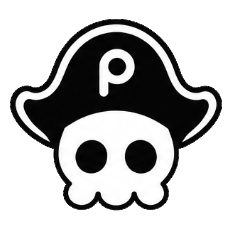
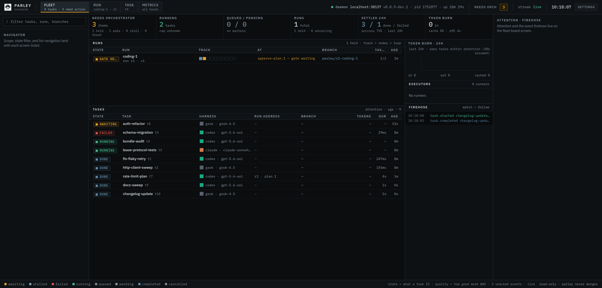

<div align="center">



# Parley

**Give your agent a crew.**

One orchestrating agent, many coding agents, every branch reviewed before it lands.

[](https://www.npmjs.com/package/@useparley/cli)
[](LICENSE)
[](https://femoral.github.io/parley/)



</div>

Parley turns the coding agent you already work with (Claude Code or any other
harness) into an orchestrator of other coding agents. You describe the work in
plain language. Your agent writes the briefs, delegates them to child agents
in isolated git worktrees, answers their questions while they work, and
reviews every branch that comes back. One local daemon coordinates the crew;
you install it, point your agent at it, and judge the results.

## Why

- **Fan out real work.** Ten briefs, ten worktrees, ten agents in parallel.
  Nothing shares a working copy, so nobody steps on anybody, and every branch
  is reviewable on its own.
- **Block on exactly what matters.** `parley watch` is the single wait
  primitive: it delivers the events that need the orchestrator (question,
  stall, failure, completion) with at-least-once redelivery until acked. No
  polling loops, no missed events.
- **The branch always comes back to you.** Parley never merges. Every task
  ends as a branch the orchestrator reviews, merges, or sends back with
  `parley fix`. Judgment stays with the orchestrator, and ultimately with you.
- **Accountable by default.** Every task records tokens, duration, profile,
  and classification. Slice it by vendor, model, or profile with
  `parley metrics` or the web Console.

## Install

```bash
npm install -g @useparley/cli         # the CLI; the daemon auto-spawns on first use
npm install -g @useparley/dashboard   # optional: Parley Console, the web cockpit
```

Requires Node 24+ and git. Each vendor CLI you delegate to must be installed
and authenticated on the machine that runs it.

## Quick start

```bash
cd your-repo
parley init     # installs orchestrator skills, detects harnesses, walks you through vendor/model allowlists
parley ui       # opens the Console, if installed
```

Then hand the keys to your agent. In your harness session:

```text
/parley-delegate

Split the API error-handling refactor into independent tasks and farm them
out. Review every branch before you merge anything.
```

The agent runs the loop from there: it registers its session, delegates each
brief into an isolated worktree, blocks on `parley watch`, answers child
questions, and reviews every finished branch. You answer the occasional
escalated question and judge the final diffs:

```bash
git diff main..parley/t1-fix-flaky
```

The delegation commands themselves (`delegate`, `watch`, `answer`, `fix`) are
an agent-facing surface; you will rarely type them. They are documented in
[How the orchestrator works](https://femoral.github.io/parley/explainer/how-the-orchestrator-works)
and the [CLI reference](https://femoral.github.io/parley/reference/cli).

## Documentation

The full documentation lives at
**[femoral.github.io/parley](https://femoral.github.io/parley/)**:

- [What is Parley](https://femoral.github.io/parley/guide/what-is-parley) and
  [Getting started](https://femoral.github.io/parley/guide/getting-started)
- [The Console](https://femoral.github.io/parley/guide/console),
  [Configuration and profiles](https://femoral.github.io/parley/guide/configuration),
  [Workflow runs](https://femoral.github.io/parley/guide/workflows)
- [Vendors and sandboxing](https://femoral.github.io/parley/guide/vendors),
  [Remote runners](https://femoral.github.io/parley/guide/remote-runners),
  [Evaluation](https://femoral.github.io/parley/guide/evaluation)
- [Writing an adapter](https://femoral.github.io/parley/reference/adapter-authoring)
  and [Troubleshooting](https://femoral.github.io/parley/reference/troubleshooting)

## Vendors

| Vendor | CLI | Status |
| ------ | --- | ------ |
| `codex` | OpenAI Codex CLI | ✅ tested |
| `grok` | Grok Build | ✅ tested |
| `claude` | Claude Code | 🧪 under testing |
| `cursor` | Cursor CLI (`cursor-agent`) | 🧪 under testing |
| `antigravity` | Antigravity CLI (`agy`) | 🧪 under testing |
| `opencode` | OpenCode | 🧪 under testing |
| `goose` | Goose | 🧪 under testing |
| `pi` | Pi coding agent | 🧪 under testing |
| `cline` | Cline CLI | 🧪 under testing |
| `kilo` | Kilo CLI | 🧪 under testing |
| `openhands` | OpenHands | 🧪 under testing |
| `hermes` | Hermes Agent | 🧪 under testing |
| `openclaw` | OpenClaw | 🧪 under testing |
| `kimi` | Kimi Code CLI | 🧪 under testing |

Every adapter accepts the same posture flags (`--sandbox
read-only|workspace|full`, `--no-network`) and passes model and reasoning
effort through opaquely (`-m`, `--effort`). Enforcement is **not** portable:
some vendors enforce postures at the OS level, some approximate them, some
accept the flag and do nothing. Each adapter declares what each posture
actually gets, the matrix below is contract-tested against those
declarations, and weak postures write a `PARLEY-DIAG` warning into the
task's `diag.log`. See
[Vendors and sandboxing](https://femoral.github.io/parley/guide/vendors) for
the full story.

<details>
<summary><b>Sandbox enforcement matrix</b> (per adapter declaration; <code>parley info</code> prints the same table)</summary>

<!-- enforcement-matrix:start -->
| Vendor | read-only | workspace | full | network:false |
| ------ | --------- | --------- | ---- | ------------- |
| `claude` | approximate (permission-mode dontAsk + tool allowlist) | approximate (permission-mode acceptEdits + tool allowlist) | enforced (bypassPermissions) | approximate (Bash sandbox settings when not full; MCP path may bypass) |
| `cline` | approximate (CLINE_COMMAND_PERMISSIONS deny-all shell (edit tools may still write)) | none (unconstrained tools + auto-approve) | enforced (unconstrained tools + auto-approve (unrestricted as requested)) | none (no first-class network toggle) |
| `codex` | enforced (sandbox_mode=read-only) | enforced (sandbox_mode=workspace-write) | enforced (sandbox_mode=danger-full-access) | enforced (sandbox_workspace_write.network_access off under workspace; ignored for read-only/full) |
| `cursor` | approximate (cli.json deny Write/Shell + no --force (denies verified to hold); reads + hub MCP allowed) | none (--force; cli.json cannot scope writes to the workspace and --sandbox is a no-op on Linux) | enforced (--force (unrestricted as requested)) | approximate (cli.json deny WebFetch(*); shell and MCP network unrestricted) |
| `antigravity` | approximate (omit dangerously-skip-permissions; no private-home permissions.allow inject (#298); all permissioned tools auto-denied incl. reads — the child cannot report over http) | none (dangerously-skip-permissions; no write confinement (path-scoped allow rules do not work)) | enforced (dangerously-skip-permissions, no --sandbox) | refused (no network lever exists (research §5); prepare refuses rather than under-isolate) |
| `goose` | approximate (GOOSE_MODE=chat (no tools / file mods)) | none (GOOSE_MODE=auto; no OS sandbox) | enforced (GOOSE_MODE=auto (unrestricted as requested)) | none (no native network toggle) |
| `grok` | enforced (bubblewrap OS sandbox; fail-closed without bwrap (#247)) | enforced (bubblewrap OS sandbox + worktree gitdir grants; fail-closed without bwrap (#247/#278)) | enforced (GROK_SANDBOX=off) | enforced (restrict_network in custom sandbox profile (sandboxed postures; ignored for full)) |
| `hermes` | approximate (HERMES_WRITE_SAFE_ROOT limited to private home (terminal may still write)) | approximate (HERMES_WRITE_SAFE_ROOT=worktree+gitdirs) | enforced (unset HERMES_WRITE_SAFE_ROOT) | none (local backend has no egress filter) |
| `kilo` | approximate (restrictive permissions + optional OS sandbox object) | none (sandbox disabled so git commits + hub MCP work) | enforced (sandbox disabled (unrestricted)) | approximate (sandbox.network=deny (also blocks hub MCP)) |
| `kimi` | approximate (--plan (soft exploration mode)) | none (print-mode afk auto-approve only) | enforced (print-mode afk auto-approve (unrestricted as requested)) | none (cannot be enforced) |
| `openclaw` | enforced (docker mode=all workspaceAccess=ro (fail-closed if image missing)) | approximate (mode=off when network on (host tools); mode=all docker when network off) | enforced (mode=off) | enforced (docker network=none under sandboxed postures) |
| `opencode` | approximate (permission deny write/edit/bash (no OS sandbox)) | approximate (permission policy only (no OS sandbox)) | enforced (permission allow-all (unrestricted as requested)) | approximate (webfetch/websearch deny only; bash can still egress) |
| `openhands` | none (no CLI sandbox matrix) | approximate (OPENHANDS_WORK_DIR soft worktree affinity) | enforced (host-local workspace; unrestricted as requested) | none (no network-off lever) |
| `pi` | approximate (--tools read-only allowlist) | none (default tools; no write sandbox) | enforced (default tools; unrestricted as requested) | refused (prepare refuses (#107)) |
<!-- enforcement-matrix:end -->

</details>

> Adapter support exists for all vendors listed, but only `codex` and `grok`
> have been exercised in sustained real-world orchestration so far. The rest
> are implemented, pass their suites, and are still being tested.

**Write your own**: adapters are a public contract in `@useparley/core`.
Point `vendors.<id>.plugin` at your module and the daemon loads it at
startup. See
[Writing an adapter](https://femoral.github.io/parley/reference/adapter-authoring).

## Configuration in one glance

`~/.parley/parley.json`, all optional, validated loudly:

```json
{
  "vendors": {
    "grok":  { "env": { "XAI_API_KEY": "your-key-here" } },
    "codex": { "models": { "gpt-5.6-sol": { "efforts": ["low", "high"], "default": "low" } } }
  },
  "profiles": {
    "heavy": { "vendor": "grok",  "model": "grok-4.5", "effort": "high" },
    "cheap": { "vendor": "codex", "effort": "low" }
  }
}
```

Model allowlists are deny-by-default and enforced by the daemon; profiles are
named launch templates the agent can compare head-to-head in metrics. Details
in [Configuration and profiles](https://femoral.github.io/parley/guide/configuration).

## Beyond one-shot tasks

- **Workflow runs**: multi-step pipelines (plan, gate, implement, review xN)
  written down as files, executed by the daemon, with human-actioned gates
  and one-line-per-node status. See
  [Workflow runs](https://femoral.github.io/parley/guide/workflows).
- **Remote runners** (experimental): run children on other machines with one
  daemon and one inbox. Outbound-only runners, parley-managed git mirrors,
  branches pushed back to your remote. See
  [Remote runners](https://femoral.github.io/parley/guide/remote-runners).
- **Evaluation** (experimental): rubric-based scoring per task, so vendor and
  profile choices become measurable. See
  [Evaluation](https://femoral.github.io/parley/guide/evaluation).

## License

[MIT](LICENSE)
